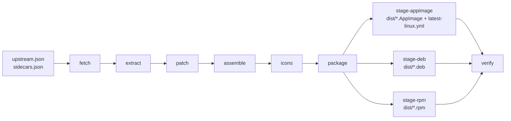
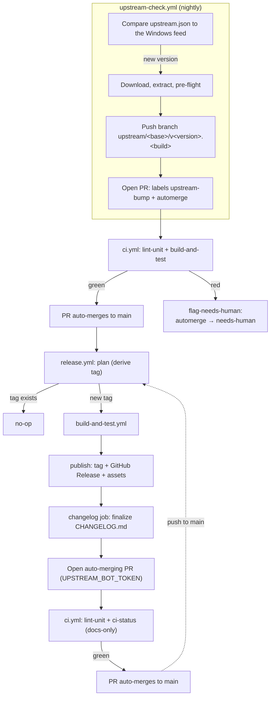

# Architecture

This page is the map of how the pipeline, packaging and CI/release automation fit together. For
day-to-day contributor workflow see [`CONTRIBUTING.md`](../CONTRIBUTING.md); for cutting a
release see [`docs/RELEASING.md`](RELEASING.md); for the required GitHub repository settings see
[`docs/BRANCH_PROTECTION.md`](BRANCH_PROTECTION.md).

## Pipeline

```text
upstream.json + sidecars.json
        │
fetch   │  download installer (SHA-512) + Electron/bun/uv (SHA-256) into .cache/
        ▼
extract │  7z installer → $PLUGINSDIR/app-64.7z → build/win-app; asar → build/app-pristine, build/app
        ▼
patch   │  git apply patches/*.patch to build/app; add out/main/linux-update.js; set package.json version
        ▼
assemble│  Electron zip + app.asar + assets + i18n + bun + uv/uvx → build/linux-unpacked (binary renamed qwen-studio)
        ▼
icons   │  resources/assets/icon.png → build/icons/{16..512}.png
        ▼
package │  per target: copy to build/stage-<t>, electron-builder --prepackaged → dist/
        ┴  (npm run build stops here)
verify  │  control fields, payload paths, desktop entries, latest-linux.yml, no package-type in AppImage
```

`fetch`, `extract`, `patch`, `assemble` and `icons` are each `scripts/<stage>.ts`; `package` is
`packageAll()` in `scripts/lib/electron-builder-config.ts`. `scripts/build.ts` runs the six in
order as `STAGES = ["fetch", "extract", "patch", "assemble", "icons", "package"]`
(`npm run build [-- --until <stage>]` stops early, e.g. `npm run patches:dev` = `--until patch`).
`verify` is a
separate step, not part of `build.ts` — `npm run build && npm run verify` (as `build-and-test.yml`
and the PR checklist run it) is what covers both. Shared helpers live in `scripts/lib/`:
`manifest.ts` (reads `upstream.json`/`sidecars.json`), `versions.ts` (`deriveVersions()`),
`hash.ts`, `download.ts`, `exec.ts`, `deb.ts` (dpkg-free deb inspection, used by both
`scripts/verify.ts` and `tests/unit/deb.test.ts`), `electron-builder-config.ts` and `paths.ts`.



## Why a separate electron-builder invocation per target

electron-builder's deb/rpm target writes `resources/package-type` and `resources/app-update.yml`
into the prepackaged directory. `package-type` makes electron-updater switch to
`DebUpdater`/`RpmUpdater` (which install with `pkexec`). If the AppImage were packed from the same
directory after the deb, it would carry `package-type=deb` and break in-app updates. Each target
therefore gets its own copy of `build/linux-unpacked` (`build/stage-<target>`, with `.so` exec bits
stripped there — see `stripExecFromSharedLibs()` in `scripts/lib/electron-builder-config.ts`) and
its own output directory (`dist/<target>`, merged back into `dist/`); only the AppImage run's
`latest-linux.yml` is published.

## Patches

| Patch | Purpose |
| --- | --- |
| `0001-linux-platform-dir.patch` | `getPlatformDir()` returned only mac/win values and threw `Unsupported platform` on Linux. |
| `0002-linux-updater.patch` | On Linux: use the GitHub provider (`sams-git-195/qwenstudio-linux`), set `allowPrerelease=false`, set `autoInstallOnAppQuit` only for AppImage, and route deb/rpm installs to the notify-only module. |

`src/app/linux-update.js` is copied into the asar as `out/main/linux-update.js` by the patch
stage. Maintenance: `npm run patches:dev`, edit `build/app/out/main/index.js`,
`npm run patches:export -- <NNNN>`, `npm run test:unit` (the pristine fixture
`tests/fixtures/app-pristine/out/main/index.js` is refreshed by the bot on every bump).

## Updater design

Verified against electron-updater 6.6.2, the version bundled by the upstream Windows app (and what
patch `0002` and `linux-update.js` are written against). The project's own `devDependencies` pin a
newer `electron-updater` (6.8.9) only to clear `npm audit` advisories in the test toolchain — it is
never bundled into the shipped app, so it does not change runtime behaviour.

- `AppUpdater` sets `allowPrerelease=true` when the app version has prerelease identifiers (ours
  always do: `1.0.3-44.1`). With that setting the GitHub provider matches release tags by
  "channel" (`44`) and skips non-semver tags such as `v1.0.3.44-1`, so nothing is ever found.
  Patch `0002` sets `allowPrerelease=false`; the provider then uses `/releases/latest` →
  `latest-linux.yml` → `semver.gt`. Releases must be normal (not prerelease) and marked latest.
- `AppImageUpdater.isUpdaterActive()` is false without `APPIMAGE`; `checkForUpdates()` resolves
  `null` without events, so deb/rpm installs would silently never notify. `linux-update.js`
  (`isNotifyOnly()` = `process.platform === "linux" && !process.env.APPIMAGE`) instead fetches
  `releases/latest/download/latest-linux.yml`, compares with `semver`, and shows the upstream
  dialog strings with "Download now" opening the releases page. It never installs anything.

## Version scheme

| Field | Example | Consumer |
| --- | --- | --- |
| `appVersion` | `1.0.3-44.1` | asar `package.json`, `latest-linux.yml`, electron-updater ordering |
| `debVersion` | `1.0.3.44-1` | deb `Version` (via `fpm --version 1.0.3.44 --iteration 1`) |
| `rpmVersion` / `rpmRelease` | `1.0.3.44` / `1` | rpm |
| `gitTag` | `v1.0.3.44-1` | git tag, GitHub Release |

`wrapper_revision` is reset to 1 on every upstream bump and incremented for wrapper-only releases.

## Launcher and sandbox

The deb target uses electron-builder's stock post-install script unmodified: it links
`/usr/bin/qwen-studio` (via `update-alternatives`, falling back to a symlink) to
`/opt/Qwen Studio/qwen-studio`, sets `chrome-sandbox` to mode 4755 only where user namespaces are
unavailable (0755 otherwise), and installs an AppArmor profile on Ubuntu 24.04+.

The rpm target instead uses custom scriptlets, `packaging/rpm/after-install.tpl` and
`packaging/rpm/after-remove.tpl`: a plain `ln -sf` symlink rather than `update-alternatives` (fpm's
rpm backend has no CLI option to emit the extra scriptlet-dependency and file-list declarations
rpmlint requires for `update-alternatives`), the same `chrome-sandbox` mode logic, and no AppArmor
step (Fedora/RHEL use SELinux, so there is nothing to install into). `after-remove.tpl`'s `%postun`
guards the symlink removal on `$1 -eq 0` so an upgrade — where the new package's post-install has
already recreated the symlink — does not delete it.

`--ozone-platform-hint=auto` is delivered through `linux.executableArgs` in
`packaging/electron-builder.base.json`, which electron-builder places in the `.desktop` `Exec=`
line for all three targets. Launching `qwen-studio` directly from a terminal runs without the
flag (X11/XWayland fallback). `--no-sandbox` is used only by `tests/smoke/smoke.sh` (Docker's
default seccomp policy blocks the user namespaces the sandbox needs), which
`tests/install/install-and-smoke.sh` runs inside the CI install-matrix containers.

## CI and release flow

`ci.yml` runs on every PR and push to `main`. `lint-unit` (typecheck, `test:unit`,
`npm audit --audit-level=high`, commitlint, conventional PR title) always runs;
`build-and-test.yml` (reusable: full build, `npm run verify`, lintian in a `debian:12` container,
rpmlint in a `fedora:41`
container, an advisory `appimagelint` pass, then a 7-leg Docker install matrix — deb on Ubuntu
22.04/24.04 and Debian 12, rpm on Fedora 40/41, AppImage on Ubuntu 22.04 and Fedora 41) is skipped
only when every changed file matches a docs-only pattern (`docs/`, `**/*.md`,
`.github/ISSUE_TEMPLATE/`, `LICENSE`, `CODEOWNERS`). `ci-status` aggregates both and is the single
required status check (see `docs/BRANCH_PROTECTION.md`); `flag-needs-human` swaps the `automerge`
label for `needs-human` on a failed upstream-bump PR instead of letting it auto-merge red.

`release.yml` runs on every push to `main`. `plan` derives the git tag from
`upstream.json` and skips the rest of the workflow when that tag already exists on
origin (so a docs-only merge, a Dependabot bump, or the workflow's own CHANGELOG PR never
re-release). Otherwise it re-runs the full `build-and-test.yml` and `publish` tags the built
commit, creates the GitHub Release (never draft/prerelease, marked latest — required for
electron-updater's GitHub provider) with `latest-linux.yml` uploaded last, and attests build
provenance. `changelog` then finalizes `CHANGELOG.md`'s `[Unreleased]` section on a
`release/changelog-<tag>` branch and opens an auto-merging PR for it (through the
`UPSTREAM_BOT_TOKEN` PAT, since a PR opened with the workflow's own `GITHUB_TOKEN` never triggers
`ci.yml` and so could never satisfy `ci-status`).

`upstream-check.yml` is the nightly bot (04:17 UTC), driven by `scripts/upstream-check.ts`: it
compares `upstream.json` against the Windows update feed, and on a new version downloads, extracts
and pre-flights the installer, then pushes one branch
(`upstream/<base>/v<version>.<build>`) and opens (or updates) one PR labelled `upstream-bump` +
`automerge`, or `needs-human` on failure.



## Package linters

lintian runs with `packaging/lintian/qwen-studio.overrides` and `--fail-on error`; rpmlint with
`packaging/rpmlint/qwen-studio.toml` and must report `0 errors`. Only findings inherent to the
verbatim Electron/upstream payload (or, for rpmlint's `explicit-lib-dependency`, an accepted
deviation documented in that file) are suppressed; each suppression carries a justification
comment.
